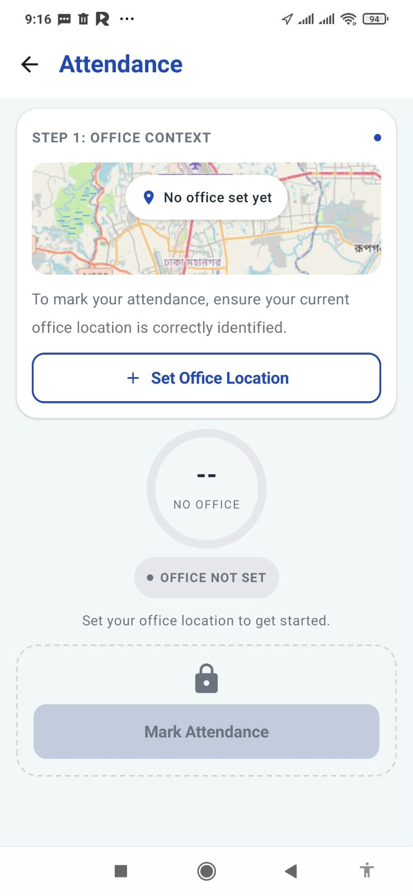
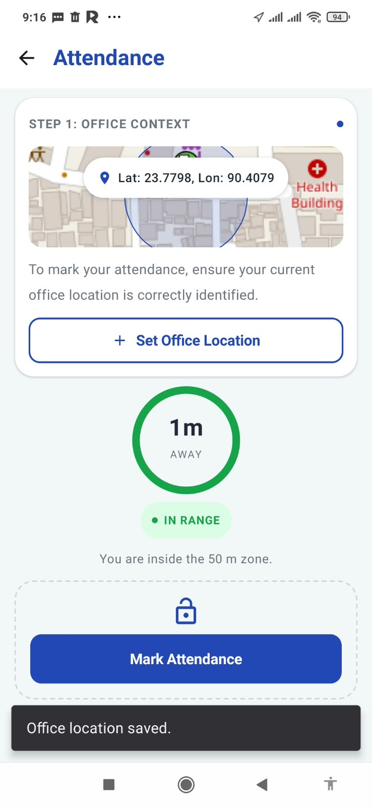
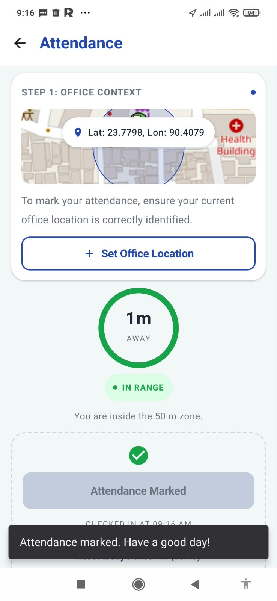

# Hajira — Geo-Fenced Attendance

Native Android (Kotlin + Jetpack Compose) app. The user saves the office location with one tap, then can only mark attendance while standing within **50 m** of it. A live ring shows the distance in real time.

## Project structure / approach

**Clean Architecture + MVVM**, with a strict one-way dependency: `presentation → domain ← data`.

```text
com.hajira.app
├── domain/          Pure Kotlin. No Android imports.
│   ├── model/       Coordinates, LocationFix, Proximity, results
│   ├── policy/      AttendancePolicy (radius, accuracy, time window), ProximityEvaluator
│   ├── geo/         GeoMath (haversine)
│   ├── repository/  Interfaces: Office / Attendance / Location
│   └── usecase/     SetOfficeLocation, ObserveProximity, MarkAttendance, ...
├── data/            DataStore repositories + FusedLocationRepository (Play Services)
├── presentation/    AttendanceViewModel, UiState/Events, Compose screen + components
└── di/              AppContainer (manual DI composition root)
```

* **`AttendanceViewModel`** combines use-case flows (`office`, `proximity`, `attendance status`, permission access) into one immutable `StateFlow<AttendanceUiState>`; one-shot messages go through a `Channel`.
* **`MarkAttendanceUseCase`** never trusts the button state: it re-checks the time window and today's record and takes a **fresh GPS fix** before saving.
* GPS updates are only collected while location access is `READY`.
* Persistence: Jetpack DataStore (office coordinates, last check-in time).
* Map: OpenStreetMap via osmdroid (no API key) with the 50 m geofence drawn on it.

### Behaviour notes

* Fixes less accurate than 50 m still show the distance but cannot unlock check-in ("WEAK SIGNAL").
* Handles: permission denied, permanently denied, approximate-only location, GPS off, mocked location (switchable in `AttendancePolicy.blockMockLocation`), and no GPS fix.
* The 09:00–10:30 window from the design is implemented but **off by default** (`AttendancePolicy.enforceTimeWindow`), because the written brief doesn't require it and it would lock reviewers out of testing. Set it to `true` to enforce it and show the footer.
* "Reset today's check-in (demo)" appears after check-in so the flow can be retried.

## Generative AI usage

I used Claude (Anthropic) as a pair-programming and review tool during the assessment. I remained responsible for the implementation, architecture, testing, and final engineering decisions.

AI assistance was used during development for:

* Initial scaffolding and implementation suggestions
* Reviewing the Clean Architecture + MVVM structure
* Identifying missing assessment requirements
* Refactoring suggestions
* Generating and improving unit-test cases
* README drafting and documentation improvements

I reviewed and validated the generated suggestions, adapted them to the project requirements, and tested the final implementation on a real Android device.

### Essential prompts

> "Please review Task 1 and let me know if it is ready for submission."

> "Complete any remaining requirements for Task 1. Please maintain a clean architecture and MVVM approach and ensure all assessment requirements are properly addressed."

The final architecture, requirement interpretation, implementation decisions, testing, and submission review were my responsibility.

## How to run

```bash
git clone https://github.com/rhrazib/Hajira.git
cd Hajira
./gradlew assembleDebug        # or open the folder in Android Studio (Koala+ / JDK 17)
./gradlew installDebug         # with a device or emulator connected
./gradlew test                 # unit tests
./gradlew assembleRelease      # APK at app/build/outputs/apk/release/
```

Requirements: Android 8.0+ (API 26), Google Play Services (for Fused Location), internet for map tiles only.

To sign the release build with your own key, create a git-ignored `keystore.properties` with `storeFile`, `storePassword`, `keyAlias`, `keyPassword`; otherwise the debug key is used.

**Testing on a real device:** Grant location permission and enable GPS, tap *Set Office Location* at the office location, then move ~100 m away to see *Out of range*, and return within the 50 m geofence to unlock check-in.

## Download

Signed release APK (Android 8.0+): see the [Releases page](https://github.com/rhrazib/Hajira/releases/latest).

## Tests

Unit tests (JUnit) cover haversine math, the policy, the proximity evaluator, and the three use cases with fake repositories (in-range / out-of-range / weak accuracy / already checked in / yesterday's record / no office / no fix / permission missing / time window).

## Screenshots

| Office not set                           | In range                           | Checked in                           |
| ---------------------------------------- | ---------------------------------- | ------------------------------------ |
|  |  |  |
